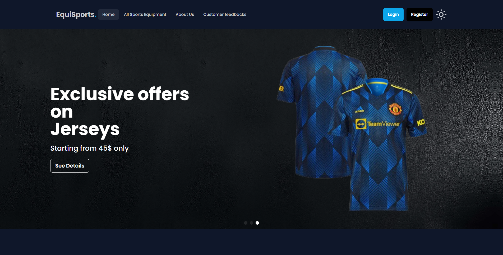

# EquiSports(Sports Equipment Store)

_A fully functional sports ecommerce platform built with MongoDB, Express.js, React, and Node.js_

---

## Introduction

EquiSports is an Ecommerce site for the sports lover and athletics enthusiasts people. User can purchase products from this store and add their own store in this website. This website contains modern UI with user-friendly transitions and animations. People Can Login and Logout to save their credentials and their added products is visible over there.


## Key Features:

- **Good-looking UI**: User Friendly and Modern UI with Dark mode toggle. reusable components used for layout design.
- **User Authentication**: Register, log in functionality added using firebase authentication.
- **Product Showcase**: Users can see various products that were fetched through mongodb Database.
- **Add Products**: Users can Add their own products and in another route users can see their added product.
- **Equipment list**: Users can see their added sports equipment in a route in a card format.
- **Protected Routes**: The `add Products` and `my equipment list` routes are protected. Only logged In users can see it.
- **Data Protection**: The MongoDB database will save their data and for this reason they will have their data protected somewhere.

---

## Technologies Used

- **Frontend**:

  - React.js
  - React Router (for navigation)
  - Axios (for HTTP requests)
  - CSS3, Tailwind, DaisyUI (for styling)
  - react-awesome-reveal, react-icons, react-toastify, react-tooltip
  - swiper, sweet alert

- **Backend**:

  - Node.js
  - Express.js
  - MongoDB (NoSQL database)

- **Other Tools**:

  - dotenv(for environment variables)
  - firebase(for authentication)

---

## Dependencies Used

```json
"dependencies": {
   "@emotion/react": "^11.13.5",
    "autoprefixer": "^10.4.20",
    "firebase": "^11.0.2",
    "postcss": "^8.4.49",
    "react": "^18.3.1",
    "react-awesome-reveal": "^4.2.14",
    "react-dom": "^18.3.1",
    "react-icons": "^5.4.0",
    "react-router-dom": "^7.0.2",
    "react-toastify": "^10.0.6",
    "react-tooltip": "^5.28.0",
    "sweetalert2": "^11.14.5",
    "swiper": "^11.1.15"
}
```

## How to Run Locally

1. Clone the repository:
   ```bash
   git clone git@github.com:shihabhq/equisports.git
   cd equisports
   ```
2. Install Dependencies:
   ```bash
   yarn
   ```
3. Create a .env file and add your Firebase & backend API keys

4. Start the development server:
   ```bash
   yarn start
   ```

## Project Structure

```plaintext
├── README.md
├── dist
|  ├── assets
|  ├── index.html
|  └── vite.svg
├── eslint.config.js
├── firebase.json
├── index.html
├── package.json
├── postcss.config.js
├── public
|  └── vite.svg
├── src
|  ├── assets
|  ├── components
|  ├── contexts
|  ├── firebase
|  ├── hooks
|  ├── index.css
|  ├── layouts
|  ├── main.jsx
|  ├── pages
|  ├── routes
|  └── shared
├── tailwind.config.js
├── vite.config.js
└── yarn.lock
```

## Links

Live Link: [Click Here!](https://equisports-15df5.web.app)

Serverside GitHub Repository: [click Here!](https://github.com/shihabhq/equisports-server)
